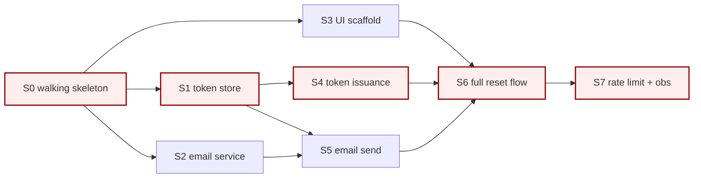

# Dependencies and Sequencing — Building the DAG

A plan is a **graph**, not a list. Lists hide three things every planner needs to see: what's parallelizable, what's on the critical path, and where the cycles are. This reference covers how to build the dependency DAG and use it to drive sequencing decisions.

## Table of contents

1. [Why a DAG, not a list](#1-why-a-dag-not-a-list)
2. [Building the DAG — procedure](#2-building-the-dag--procedure)
3. [Forms: adjacency list vs Mermaid vs waves](#3-forms-adjacency-list-vs-mermaid-vs-waves)
4. [Critical path — what it is and why to protect it](#4-critical-path--what-it-is-and-why-to-protect-it)
5. [Waves and parallel work](#5-waves-and-parallel-work)
6. [Cycles — how to spot and how to resolve](#6-cycles--how-to-spot-and-how-to-resolve)
7. [External dependencies and the seam contract](#7-external-dependencies-and-the-seam-contract)
8. [Sequencing heuristics: risk-first, value-first, cost-of-delay](#8-sequencing-heuristics-risk-first-value-first-cost-of-delay)

---

## 1. Why a DAG, not a list

A numbered list of slices implies sequential execution. That's almost always wrong. Real work has structure: some slices truly block others; many are independent; some have soft dependencies (faster if one comes first, but possible in either order).

The DAG forces the planner to **name dependencies explicitly**. Once they're named:

- **Parallel work becomes visible.** Two slices with no path between them in the DAG can run concurrently. The plan's calendar length is determined by the *longest path*, not the *total work*.
- **The critical path is identifiable.** The longest path through the DAG is what determines minimum calendar time. Slack lives off the critical path; risk on the critical path is risk to the whole plan.
- **Cycles surface.** A cycle in the dependency graph means the decomposition is wrong — you've split work that needs to ship together. Better to see it now than mid-flight.
- **Blockers are predictable.** When a slice goes BLOCKED, the DAG tells you exactly which downstream slices are affected and which are still safe to progress on.

A linear plan that *says* "this is the order" without justification is hiding all of this. Build the DAG.

---

## 2. Building the DAG — procedure

A repeatable approach. Works for plans of 5 slices and plans of 50.

### Step 1: List slices without ordering

Write down every slice — including the walking skeleton, spikes, operational slices — in a flat list with their IDs and one-line descriptions. Don't think about order yet. Don't number them.

### Step 2: For each slice, ask: "What must be true *before* this can start?"

Not "what comes before" — that's vague. Ask **what specific conditions must hold**. Some come from other slices; some come from external sources.

Example for "S5 — send reset email":
- Token must exist in the database (from S2 — token store)
- Email template must be approved (from S4 — UI scaffold or content team)
- SES integration must be working (from S0 — walking skeleton)
- Rate limit policy must be defined (from R1's spike, S1.5)

Each "from X" is a dependency edge.

### Step 3: Record edges

For each slice, list its **direct dependencies** — the slices it can't start without. Direct, not transitive. (If S5 needs S2, and S2 needs S0, you record S5→S2 and S2→S0, not S5→S0.)

### Step 4: Audit for cycles

Walk the graph. If any slice reaches itself by following edges, you have a cycle. Resolve before proceeding (see §6).

### Step 5: Compute waves

Wave 1 = all slices with no dependencies (start immediately).
Wave 2 = all slices whose dependencies are in Wave 1.
Wave 3 = all slices whose dependencies are in Wave 1 or 2.
...and so on.

The number of waves is the minimum execution length in "wave-units." If a wave has more slices than the executing team/agent can handle in parallel, that wave will take multiple wall-clock periods — but the DAG still helps you choose *which* slices to run first within the wave (see §8).

### Step 6: Mark the critical path

The critical path is the longest path from Wave 1 to a terminal slice (a slice with no children). Identify it and mark it in the plan. See §4.

---

## 3. Forms: adjacency list vs Mermaid vs waves

Three forms; use whichever is clearest for the plan's size and audience.

### Adjacency list (default for plans ≤ ~15 slices)

```
S0 (walking skeleton)  →  S1, S2, S3
S1 (token store)       →  S4, S5
S2 (email service)     →  S5
S3 (UI scaffold)       →  S6
S4 (token issuance)    →  S6
S5 (email send)        →  S6
S6 (full reset flow)   →  S7
S7 (rate limit + obs)  →  DONE

Critical path: S0 → S1 → S4 → S6 → S7  (5 hops)
```

Compact, scannable, lives well in plain text. Best for the plan document itself.

### Mermaid graph (for plans ≥ ~15 slices or where visual structure helps)



Renders in any Markdown viewer that supports Mermaid (most modern ones). Use sparingly — the visual is impressive but the adjacency list is more durable in plain text contexts.

### Wave layout (for plans where the parallelism story matters most)

```
Wave 1 (parallel):  S0
Wave 2 (parallel):  S1, S2, S3   ── after S0
Wave 3 (parallel):  S4, S5       ── after S1, S2
Wave 4:             S6           ── after S3, S4, S5
Wave 5:             S7           ── after S6
```

Useful in handoff batons: tells the executing skill exactly which slices it can run in parallel. Also makes the calendar story obvious — 5 waves, regardless of total slice count.

Often all three forms appear in a complete plan: adjacency list in the body, wave layout in the executive summary, Mermaid in an appendix.

---

## 4. Critical path — what it is and why to protect it

The **critical path** is the longest dependency chain through the DAG. Its length determines the minimum calendar time to complete the plan.

### Why it matters

- **Slack lives off the critical path.** If S2 is not on the critical path, S2 can slip by some amount without delaying the plan. If S1 is on the critical path, S1 slipping by a day delays the whole plan by a day.
- **Risk on the critical path is plan-level risk.** If R3 (a "Medium" risk) is on a critical-path slice, it deserves Medium-impact treatment for the plan. The same risk on a non-critical slice may be safely accepted.
- **Protect, parallelize, or shorten.** Three moves to shrink the critical path:
  - **Protect** it: assign your strongest reviewer, frontload it in the schedule, watch it daily.
  - **Parallelize** within it: see if a critical-path slice can itself be decomposed into parallel sub-slices.
  - **Shorten** it: question whether a slice on it can be smaller, or whether a different decomposition produces a shorter critical chain.

### Marking the critical path in the plan

Note it explicitly in the DAG section. Example:

```
Critical path: S0 → S1 → S4 → S6 → S7  (5 slices on the path; longest chain)

Off-critical slices with slack:
  S2 (slack: 1 wave)
  S3 (slack: 2 waves)
  S5 (slack: 0; on critical via different chain S0→S1→S5→S6)
```

If a critical-path slice has any of the high-attention treatments (one-way door, materializing risk, unfamiliar tech), flag it. Critical-path one-way doors are where plans break catastrophically.

---

## 5. Waves and parallel work

The wave layout (§3) is also a **scheduling tool**.

### Within a wave, choose by:

1. **Risk** — riskier first. If a wave has 4 slices and one of them is uncertain, run the uncertain one first; if it discloses new information, the others can absorb the change before they've started.
2. **Critical path position** — critical-path first. Slack-bearing slices can wait if attention is limited.
3. **Reviewer availability** — if certain slices need scarce review attention, schedule them when the reviewer is available.
4. **Cognitive load** — group similar slices for the executing skill if possible (e.g., schedule all the data-layer slices together so the executor isn't context-switching).

### Constraints on parallel execution

- **Same files, same merge conflicts.** Two parallel slices touching the same files will collide. If unavoidable, sequence them; if avoidable, decompose so they don't.
- **Shared infrastructure under construction.** Two parallel slices that both depend on something *being built* in Wave 1 cannot both start in Wave 2 until that thing exists.
- **Single executor bottlenecks.** A single coding agent can't actually run four slices simultaneously. The DAG describes *what could be parallel*; the schedule describes *what will be*. Don't conflate them.

---

## 6. Cycles — how to spot and how to resolve

A cycle in the DAG means the plan is undeployable. Two or more slices depend on each other in a loop; neither can start.

### Spotting cycles

In small graphs, by inspection. In larger ones:

- Walk the graph from each slice; if you reach the starting slice, that's a cycle.
- Tools: any directed-graph linter; `tsort` on UNIX; Mermaid will render but cycles produce nonsensical layouts.

### Why cycles appear

Almost always because the decomposition is wrong:

- **The two slices are really one slice.** "Schema migration" and "first feature using the new schema" feel separable but really aren't — the migration isn't done until the feature using it works. Merge them, or **split the migration into a stub-then-real two-step**.
- **The dependency direction is wrong.** "S5 needs the email template" — does it really? Maybe S5 needs *an* email template, and a stub one is fine for S5 to complete; the "real" template is its own later slice that uses S5's output to validate itself.
- **One of the dependencies is a soft preference, not a hard requirement.** Soft preferences don't go in the DAG; they go in a "would be nice" section.

### Resolving cycles — three moves

1. **Merge.** If two slices truly require each other, ship them as one slice with broader scope. Accept the size; it's still better than a cycle.
2. **Stub-and-replace.** Slice A ships first with a stub for what it would normally need from Slice B; Slice B ships second using A's output; an optional Slice C replaces A's stub with the real B-derived value if needed.
3. **Re-decompose.** Step back; the slices in the cycle suggest the wrong dimension was chosen for splitting. Try splitting by a different axis (see [`decomposition.md`](decomposition.md) §4).

A plan with an unresolved cycle is not ready to deliver. Resolve before proceeding.

---

## 7. External dependencies and the seam contract

Not all dependencies are slices in your plan. Some are:

- **Another team's slice** — they're shipping the auth migration; you depend on it for S5
- **A vendor's roadmap** — they're launching a new endpoint in week 4; your S6 assumes it
- **A platform feature** — a new infra capability that's planned but not committed
- **A regulatory or business deadline** — a date that constrains the plan

External dependencies should appear in the DAG as **external nodes** (drawn distinctly), with the same edges as internal slices. They're also risks (coordination category — see [`risk-and-spikes.md`](risk-and-spikes.md) §2) and should appear in the risk register.

### The seam contract

For every external dependency, the plan should answer:

1. **What exactly are we depending on?** Specific behavior, interface, or commitment — not "the auth migration."
2. **Who committed to it and by when?** A name, a date, a written commitment if possible.
3. **What's our fallback if it slips?** A fallback slice in the DAG, or a kill criterion.
4. **What's our trigger to escalate?** "If by date X the dependency hasn't been delivered, escalate to <person>."

A plan that depends on external work without these four items is taking on a hidden risk.

---

## 8. Sequencing heuristics: risk-first, value-first, cost-of-delay

After the DAG is built, you still have choices about *which* of the eligible slices to run first within a wave. Three heuristics, ordered by which one usually wins:

### Risk-first (default for most plans)

Run the slices that disclose the most information first. The walking skeleton is the canonical risk-first slice — it tells you about all the seams at once. Spikes are pure-risk slices and run as early as their dependencies allow.

Risk-first dominates when the plan has significant uncertainty. **If you're not confident the plan is right, schedule the risk-discovery slices first.** Replanning becomes cheaper.

### Value-first

When the plan has low risk but matters to ship something useful early, schedule the highest-value slices first. Common in mature systems doing additive work.

Value-first dominates when stakeholders need observable progress, when feature flagging lets you ship partial functionality safely, and when the slices are independent enough that early value-ship doesn't constrain later slices.

### Cost-of-delay (Reinertsen)

For each slice, estimate: **if this slice slips by a week, what's the cost?** Multiply by likelihood; schedule highest-cost-of-delay first.

Cost-of-delay dominates when slices have very different value-per-unit-time profiles — e.g., one slice unblocks a $X/day revenue stream while another is internal hygiene. Reinertsen's CD3 (cost of delay divided by duration) is the rigorous version.

### Combining them

In practice, plans use a hybrid:

1. Walking skeleton always first (risk-first dominates the start)
2. Spikes for the riskiest unknowns next (risk-first continues)
3. Once risk is contained, switch to value-first or CD3 for the remaining slices
4. Critical-path slices get priority over off-critical ones at each stage

Document the sequencing choice and its rationale in the plan. "Wave 2 prioritizes S1 over S2 because S1 is on the critical path; Wave 3 prioritizes S5 over S4 because S5's cost-of-delay is higher (R3 dependency)." Future-you will thank present-you for the reasoning.
