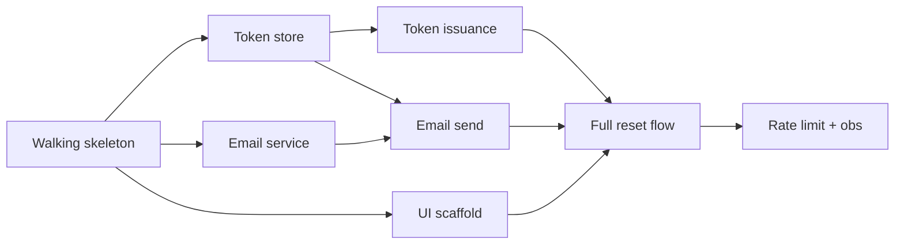

# Plan Anatomy — Section by Section

This reference is the deep guide to writing each section of an implementation plan. The template lives at [`../assets/implementation-plan.md`](../assets/implementation-plan.md); this file explains *why* each section exists and what good and bad versions look like.

## Table of contents

1. [Header and metadata](#1-header-and-metadata)
2. [Outcome statement](#2-outcome-statement)
3. [Context and links](#3-context-and-links)
4. [Constraints and non-goals](#4-constraints-and-non-goals)
5. [Risk register (inline)](#5-risk-register-inline)
6. [Walking skeleton](#6-walking-skeleton)
7. [Vertical slices](#7-vertical-slices)
8. [Dependency DAG](#8-dependency-dag)
9. [Reversibility and one-way-door review](#9-reversibility-and-one-way-door-review)
10. [Kill criteria for the plan as a whole](#10-kill-criteria-for-the-plan-as-a-whole)
11. [Handoff points](#11-handoff-points)
12. [Open questions](#12-open-questions)
13. [Status (alive)](#13-status-alive)

---

## 1. Header and metadata

Minimal but disciplined. Every plan opens with:

- **Title** — what's being built, in one line
- **Plan ID** — a short slug used to reference the plan from batons and from other docs (`plan-2026-pwd-reset`, `plan-checkout-v2`). Use kebab-case; keep it readable; never reuse.
- **Owner** — the person responsible for the plan's existence and updates. Not the implementer, the planner.
- **Created / last updated** — dates, not "recently"
- **Status** — one of `DRAFT`, `ACTIVE`, `BLOCKED`, `DONE`, `ABANDONED`. Set deliberately; the difference matters.
- **Source** — what generated this plan (spec, ADR-XXXX, decision brief from brainstorm session of <date>, user request). The plan should be traceable upward.

A plan with no ID can't be referenced by batons; a plan with no source can't be re-justified when scope is challenged. Both are required.

---

## 2. Outcome statement

The single most important section. One to three sentences naming the **measurable result** the user wants.

**Test:** if someone read only the outcome statement, could they tell whether the plan succeeded? If not, the outcome is too vague.

### Bad

> Improve password reset.

> Users can reset their password through the application by entering their email and following the link sent to them.

The first is vague. The second is a *feature description* dressed up as an outcome. Neither answers "how do we know we won?"

### Good

> A user who has forgotten their password can recover account access within 5 minutes, with no human support intervention, at least 95% of the time. Measured by: median time from "forgot password" click to next successful login, and by support ticket volume for password-related issues.

This is measurable. It implies design constraints (the 5-minute target rules out manual review; the 95% target requires telemetry). It can be checked at the end.

### Patterns that produce good outcomes

- **Jobs-to-be-done framing:** "When [situation], I want to [motivation], so I can [outcome]." Forces user perspective.
- **Quantitative anchor:** at least one number. "Reduces X by Y%" or "Handles Z load at W latency."
- **Negative space:** what's the world like *without* this work? If you can't tell the difference, the outcome isn't worth pursuing.

---

## 3. Context and links

Three to six bullets. Enough that a new reader (or future-you) understands why this plan exists without re-reading every input artifact. Link to:

- The spec, PRD, or originating ticket
- Any ADRs the plan implements
- The brainstorming decision brief, if applicable
- The most recent design doc
- Relevant prior plans if this is a continuation

Do not dump these inline. Link them. The plan is not a knowledge base; it's a delivery contract.

---

## 4. Constraints and non-goals

Two lists. Both required.

**Constraints** — what is fixed and not subject to negotiation during execution. Examples:

- Must use existing auth provider; no new IdP
- Must ship behind feature flag `pwd_reset_v2`
- Database is Postgres 15; no schema changes outside `auth` schema
- Deadline: end of Q3 (regulatory)

**Non-goals** — what this plan deliberately is *not* doing, even though a reasonable person might expect it to. Examples:

- Not changing the password complexity policy (separate plan)
- Not adding SMS-based reset (out of scope this quarter)
- Not migrating legacy users — handled by `plan-2026-legacy-auth-migration`

Non-goals are how you prevent scope creep cheaply. Every "no" written down is a defensive moat. Be generous with non-goals; they don't cost anything to write.

---

## 5. Risk register (inline)

The top risks, inline in the plan. Format: a small table or structured list. For each risk:

- **Description** — one sentence
- **Likelihood** — Low / Med / High
- **Impact** — Low / Med / High (impact if it materializes; what gets broken or delayed)
- **Mitigation or spike** — the action being taken; if "spike," reference the spike's slice ID

A plan with no risk register is a plan whose author hasn't stopped to think. Push back. See [`risk-and-spikes.md`](risk-and-spikes.md) for the full risk taxonomy and spike design.

The risk register is **inline in the plan**, not a separate file, because it travels with the plan and changes with it. The standalone template at [`../assets/risk-register.md`](../assets/risk-register.md) is for when the risk landscape is large enough to merit its own document (5+ significant risks, complex interactions).

---

## 6. Walking skeleton

Explicit, named **Step 0 (or Step 1)** of the plan. Describes the thinnest possible end-to-end slice that exercises every architectural seam.

For a web app: a stub endpoint that calls a stub service that returns a stub value, deployed through the real pipeline to the real environment, with logs visible in the real observability stack.

For a data pipeline: a single record flowing through the real source → real transformation (no-op transform is fine) → real sink → real downstream consumer.

For a refactor: a no-op refactor on a single function, merged and shipped, proving the test suite and deploy still work for the affected area.

**What the walking skeleton proves:**

- The deploy pipeline works end-to-end
- The seams between components are wireable as designed
- The observability/logging/error handling actually fires
- The integration points (auth, db, external APIs) authenticate and return as expected
- The test infrastructure can run the new test types this plan will rely on

**What it doesn't prove:** correctness, performance, edge cases. That's for later slices.

If the user objects that "we don't need a walking skeleton," ask: when was the last time someone ran the entire pipeline end-to-end with the *current* versions of every dependency? If "I don't know," the skeleton is required. If "yesterday, on a feature like this," accept it and move on — but say so in the plan ("walking skeleton omitted; reference: PR #1234 from <date> exercised the same seams").

---

## 7. Vertical slices

The body of the plan. Each slice is a section, in approximate execution order (the DAG handles the real ordering; this is the canonical reading order).

For each slice, the plan records:

- **Slice ID** — short, plan-scoped (`S1`, `S2`, … or `walk-skel`, `pwd-token`, `pwd-email`)
- **Title** — what it delivers in user-observable terms
- **What it ships** — the deliverable in one to three bullets. Files, endpoints, behavior visible to a stakeholder.
- **Acceptance criteria** — checklist; see [`acceptance-and-kill-criteria.md`](acceptance-and-kill-criteria.md)
- **Kill criteria** — when to abandon or pivot this slice; required for one-way doors
- **Observability criteria** — for slices that touch production
- **Reversibility tag** — 🚪🚪 two-way or 🚪 one-way
- **Depends on** — slice IDs that must complete first
- **Enables** — slice IDs unblocked by this one (cross-reference; redundant with the DAG but useful inline)
- **Sized** — t-shirt size (XS / S / M / L), or a rough hour/day band. If "L" or above, the slice is too big — decompose.
- **Spike?** — boolean; if true, this is an investigation with a written deliverable, not a production change
- **Handoff** — which skill executes this slice (`coding`, `project-git`, `software-architect` if a design gap surfaces, user, etc.)

INVEST applies per slice. See [`decomposition.md`](decomposition.md) for slice-splitting patterns when a candidate slice fails INVEST.

---

## 8. Dependency DAG

A directed acyclic graph of slices. Two acceptable forms:

**Adjacency list (preferred for plans with <15 slices):**

```
S0 (walking skeleton) → S1, S2, S3
S1 (token store)      → S4, S5
S2 (email service)    → S5
S3 (UI scaffold)      → S6
S4 (token issuance)   → S6, S7
S5 (email send)       → S6
S6 (full reset flow)  → S7
S7 (rate limit + obs) → DONE
```

**Mermaid graph (for plans with 15+ slices or where the visual helps):**



See [`dependencies-and-sequencing.md`](dependencies-and-sequencing.md) for critical-path identification and parallel-wave reasoning.

The DAG must be acyclic. If a cycle appears, the decomposition is wrong — split or merge.

---

## 9. Reversibility and one-way-door review

A subsection that surfaces every 🚪 one-way-door slice and what guards it. For each:

- The slice ID
- Why it's one-way (schema change in shared table; public API; vendor commit; etc.)
- The rollback plan (often: "no rollback; forward-fix only") — or the explicit decision to accept no rollback
- The kill criterion (when do we *not* commit this even though we're at the door?)
- The reviewer — who, other than the implementer, has eyes before commit

This section is where you find the most expensive mistakes before they happen. Spend time here.

---

## 10. Kill criteria for the plan as a whole

In addition to per-slice kill criteria, the plan has **at least one kill criterion at the plan level**: a condition under which the entire plan is abandoned or returned to design.

Examples:

- "If after Wave 1 (S0-S2), the integration test against the email provider has p99 latency > 30s, abandon and re-plan with a different provider."
- "If the spike (S1.5) reveals that legacy users cannot be migrated without a multi-week data backfill, return to design."
- "If by end of week 3, fewer than half of the Wave 1 slices are DONE, replan."

A plan with no kill criterion at the plan level is a plan that will quietly drag forever. Annie Duke's "Quit" frames this well: pre-commit to the conditions under which you'll stop, when you can think clearly.

---

## 11. Handoff points

A table or structured list of every skill-boundary transition in this plan. For each:

- The slice ID where the handoff happens
- From skill → to skill (`implementation-planner` → `coding`; `coding` → `project-git`; `coding` → `software-architect` if a design gap is surfaced)
- The trigger (when this handoff is initiated)
- The baton file path or section reference (where the baton lives or will live)

This section is the **map of cross-skill work**. Every handoff in this map should have a corresponding baton document when execution reaches it.

---

## 12. Open questions

What was deliberately left unanswered. Each question needs:

- The question itself, sharply
- The owner (who answers it)
- The deadline (by when)
- The slice it blocks (if any)

Open questions are the future spike candidates. If an open question doesn't have an owner, it's actually a *hidden risk* — promote it to the risk register or assign an owner.

---

## 13. Status (alive)

This section is the plan's heartbeat. It updates as work proceeds. Format: dated entries, newest first, never edited (only appended).

```
## Status

### 2026-05-12
- S0 walking skeleton: DONE (PR #441, merged)
- S1 token store: IN PROGRESS (assigned: coding skill, baton: batons/2026-05-12-S1.md)
- Risk R2 (email provider latency) materialized — see baton update
- New risk added: R5 (legacy user emails bounce) — see register

### 2026-05-10
- Plan created from ADR-0014
- All slices sized; S0 ready to start
- One open question (Q1: rate-limit threshold) deferred to S7
```

The status section is **append-only** during the active life of the plan. Don't rewrite history. The lineage is part of the artifact's value — future-you (and any auditor) needs to see how the plan evolved.

When a plan reaches `DONE` or `ABANDONED`, write a final retrospective entry at the bottom: what shipped, what got cut, what surprised you, what you'd do differently. This is the input to better plans next time.

---

## A worked example header (concrete shape)

```
# Implementation Plan: Password Reset v2

- Plan ID: plan-2026-pwd-reset-v2
- Owner: <user>
- Created: 2026-05-10
- Last updated: 2026-05-12
- Status: ACTIVE
- Source: ADR-0014 (Password Reset Architecture), PRD-checkout-q3.md

## Outcome
A user who has forgotten their password can recover account access within
5 minutes, with no human support intervention, at least 95% of the time.
Measured by median time-to-recovery and support ticket volume.

## Context
- ADR-0014 specifies token-based reset with email delivery
- Replaces legacy security-question flow (deprecated 2024)
- Behind feature flag pwd_reset_v2; legacy flow remains until cutover plan

## Constraints
- Must use existing SES integration; no new email vendor
- Token TTL: 30 minutes (per ADR-0014)
- Must support legacy account migration without forced re-registration

## Non-goals
- SMS-based reset (out of scope this quarter)
- Password complexity changes (separate plan)
- Legacy user backfill (plan-2026-legacy-auth-migration)

## Risks (top)
| ID  | Risk                                          | L | I | Mitigation                |
|-----|-----------------------------------------------|---|---|---------------------------|
| R1  | SES rate limit at peak                        | M | H | Spike S1.5; queue if needed |
| R2  | Token replay if not stored hashed             | L | H | Hash at rest (ADR-0014)   |
| R3  | Legacy user lookup misses email-only accounts | M | M | Spike S0.5                |

[…]
```

That's the level of crispness expected at the top. The rest of the plan follows the section order above.
