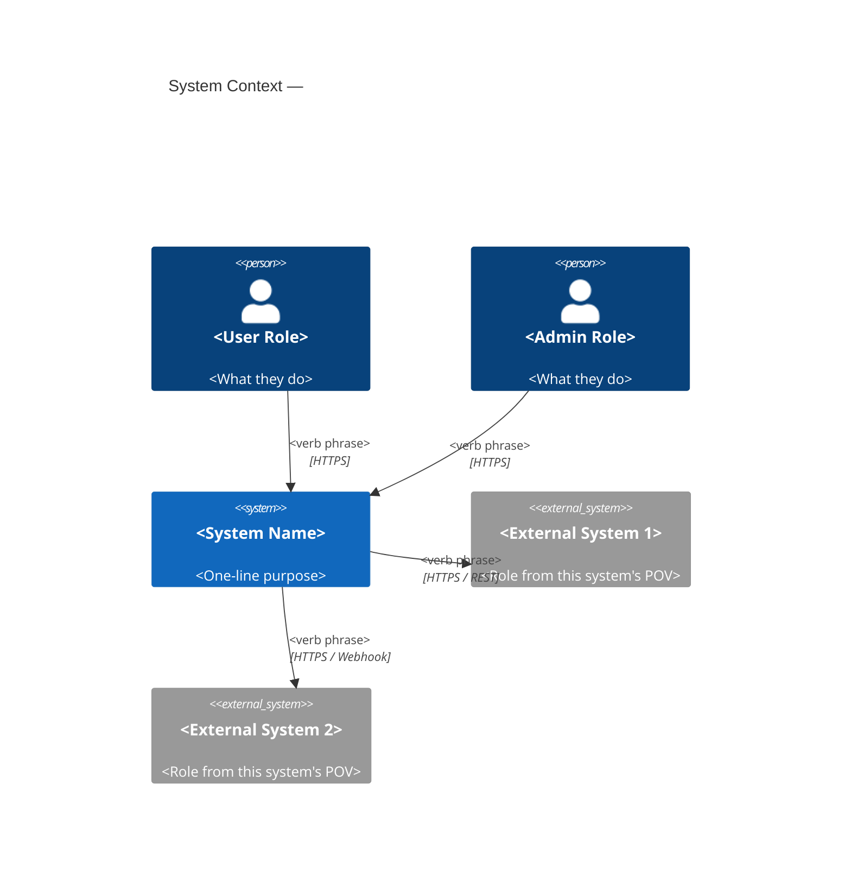
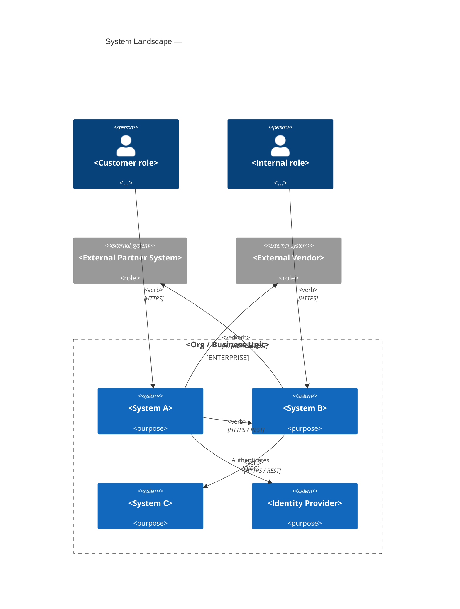
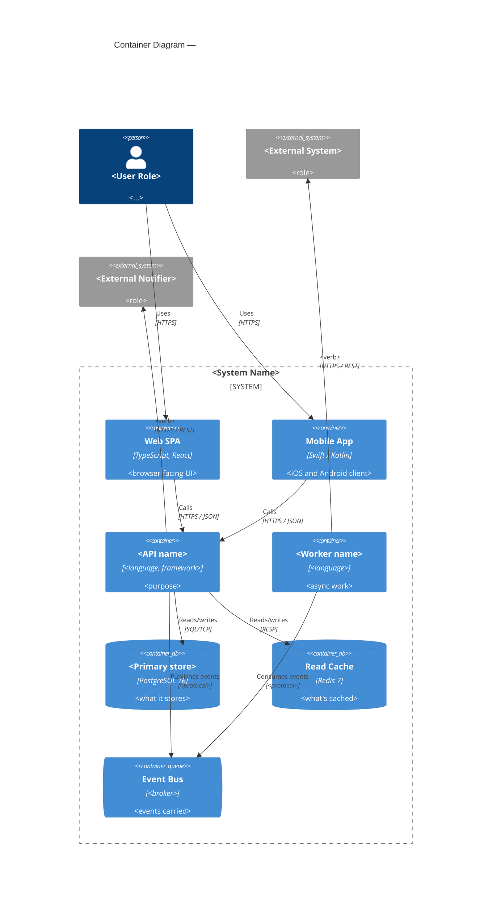
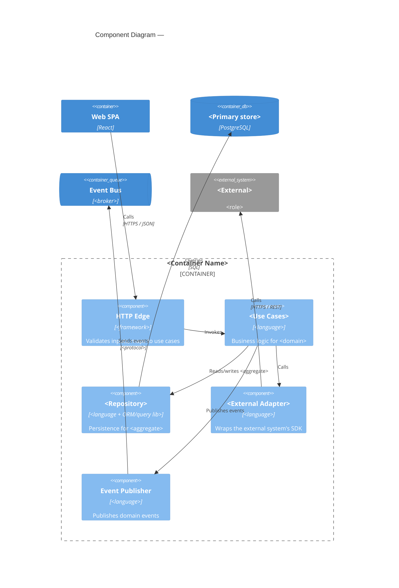
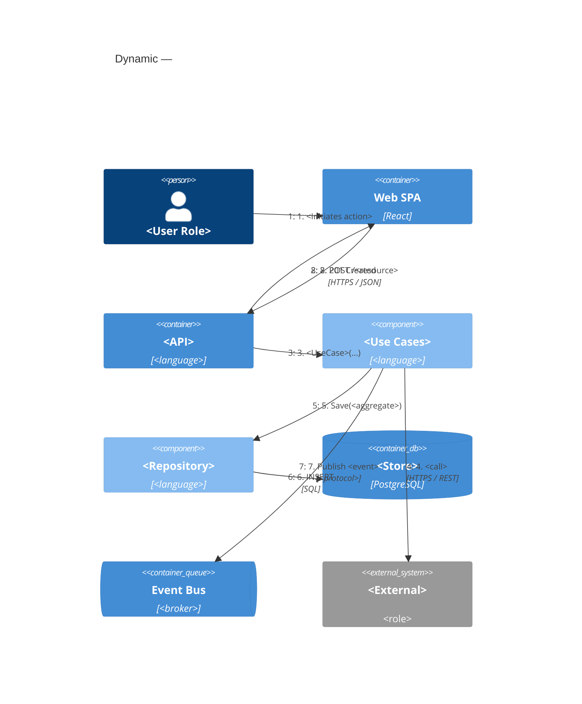
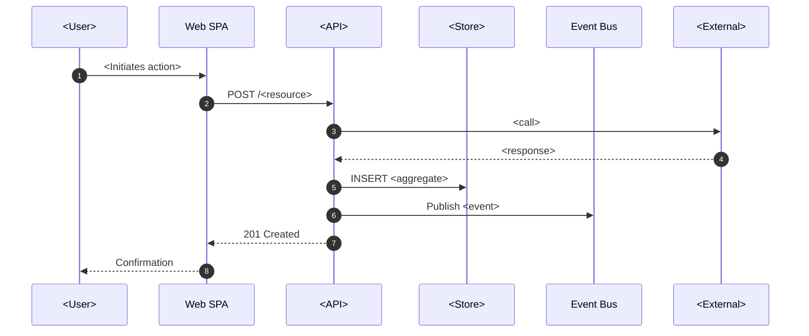
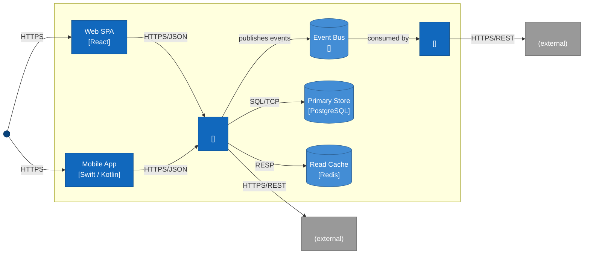
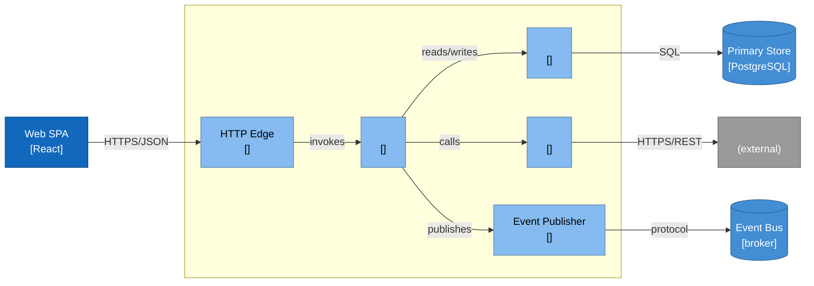
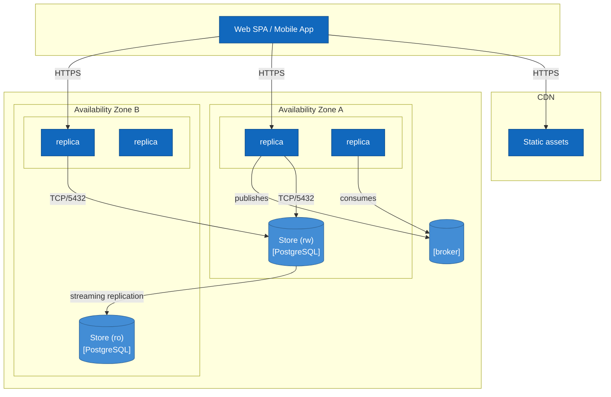

# C4 Skeletons — Quick-Start Templates

Ready-to-copy mermaid templates for every C4 diagram type, with placeholder names you can swap in for your real ones. Conventions follow `references/c4-and-diagrams.md`.

Every skeleton also has a **flowchart fallback** at the bottom of the file — for environments where mermaid's experimental C4 renderer misbehaves.

Element-id naming convention used throughout: short lowercase tokens (`api`, `db`, `worker`), all unique within one diagram. Display names go in the quoted strings.

---

## Level 1 — System Context



---

## Level 1 — System Landscape (multi-system / solution architecture)



---

## Level 2 — Container



---

## Level 3 — Component (zoom into one container)



---

## Dynamic — Scenario / Sequence Across Containers



**Sequence-diagram alternative** — same flow, more compact, renders reliably everywhere:



---

## Deployment

```mermaid
C4Deployment
    title Deployment — <System> (<region/topology>)

    Deployment_Node(clientdev, "<Client Device>", "Browser / iOS / Android") {
        Container(client, "Web SPA / Mobile App", "<tech>")
    }

    Deployment_Node(cdn, "CDN", "<provider>") {
        Container(assets, "Static assets", "JS / CSS / images")
    }

    Deployment_Node(region, "<Cloud Region>") {
        Deployment_Node(azA, "Availability Zone A") {
            Deployment_Node(computeA, "<Compute>", "<k8s / ECS / Cloud Run>") {
                Container(apiA, "<API> replica", "<tech>")
                Container(workerA, "<Worker> replica", "<tech>")
            }
            Deployment_Node(dbnodeA, "<DB primary>", "<tech>") {
                ContainerDb(dbA, "<Store (rw)>", "<tech>")
            }
        }
        Deployment_Node(azB, "Availability Zone B") {
            Deployment_Node(computeB, "<Compute>", "<k8s / ECS / Cloud Run>") {
                Container(apiB, "<API> replica", "<tech>")
                Container(workerB, "<Worker> replica", "<tech>")
            }
            Deployment_Node(dbnodeB, "<DB standby>", "<tech>") {
                ContainerDb(dbB, "<Store (ro)>", "<tech>")
            }
        }
        Deployment_Node(brokernode, "<Managed broker>", "<tech>") {
            ContainerQueue(bus, "<event topic>", "<broker>")
        }
    }

    Rel(client, cdn, "Loads assets", "HTTPS")
    Rel(client, apiA, "API calls", "HTTPS")
    Rel(client, apiB, "API calls", "HTTPS")
    Rel(apiA, dbA, "Reads/writes", "TCP/5432")
    Rel(apiB, dbA, "Reads/writes", "TCP/5432")
    Rel(dbA, dbB, "Streaming replication", "TCP/5432")
    Rel(apiA, bus, "Publishes", "<protocol>")
    Rel(workerA, bus, "Consumes", "<protocol>")
```

---

## Flowchart Fallbacks (when C4 renderer fails)

Same diagrams, expressed as mermaid `flowchart` with C4 conventions imposed via styling. Renders reliably anywhere mermaid renders.

### Fallback — Context (L1)

```mermaid
flowchart LR
    user((<User Role>))
    admin((<Admin Role>))

    sys[<System Name><br/>Purpose: ...]

    ext1[<External System 1><br/>(external)]
    ext2[<External System 2><br/>(external)]

    user -->|<verb>, HTTPS| sys
    admin -->|<verb>, HTTPS| sys
    sys -->|<verb>, HTTPS/REST| ext1
    sys -->|<verb>, HTTPS/Webhook| ext2

    classDef person fill:#08427b,color:#fff,stroke:#052e56;
    classDef system fill:#1168bd,color:#fff,stroke:#0b4884;
    classDef external fill:#999,color:#fff,stroke:#666;
    class user,admin person
    class sys system
    class ext1,ext2 external
```

### Fallback — Container (L2)



### Fallback — Component (L3)



### Fallback — Deployment



---

## Quick reference — which skeleton when

| You are producing... | Use |
|---|---|
| The first slide of a system design | Level 1 — System Context |
| A solution-architecture view across multiple systems | Level 1 — System Landscape |
| The "shape of the system" picture for a design doc, ADR, or review | Level 2 — Container |
| The internal structure of a non-trivial, load-bearing container | Level 3 — Component |
| The flow for one architecturally-significant scenario (per QAS) | Dynamic (or sequence-diagram alternative) |
| The "where it runs" view for ops, availability, region, or cost discussions | Deployment |
| Any of the above but your environment can't render mermaid C4 | The matching Fallback |

For every diagram type: title, labels on every arrow, technology on inter-system arrows at L2+, explicit boundaries, and one direction of meaning per arrow.
