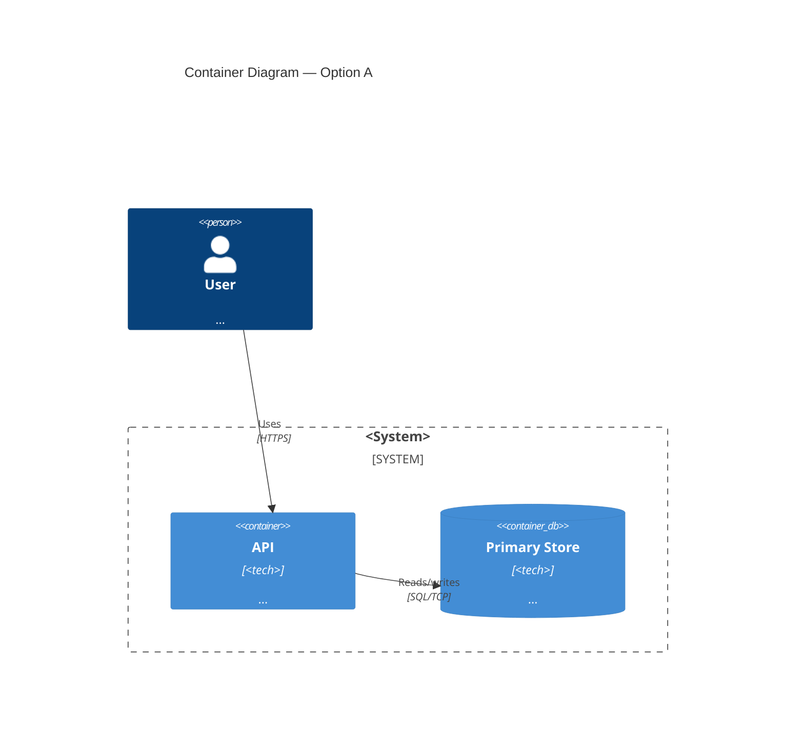
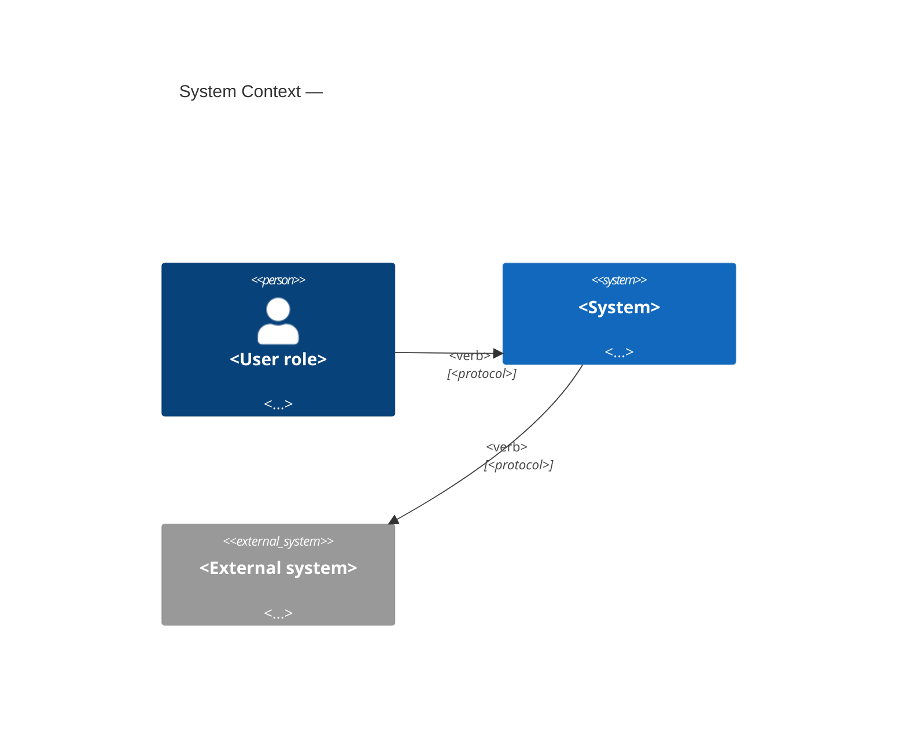
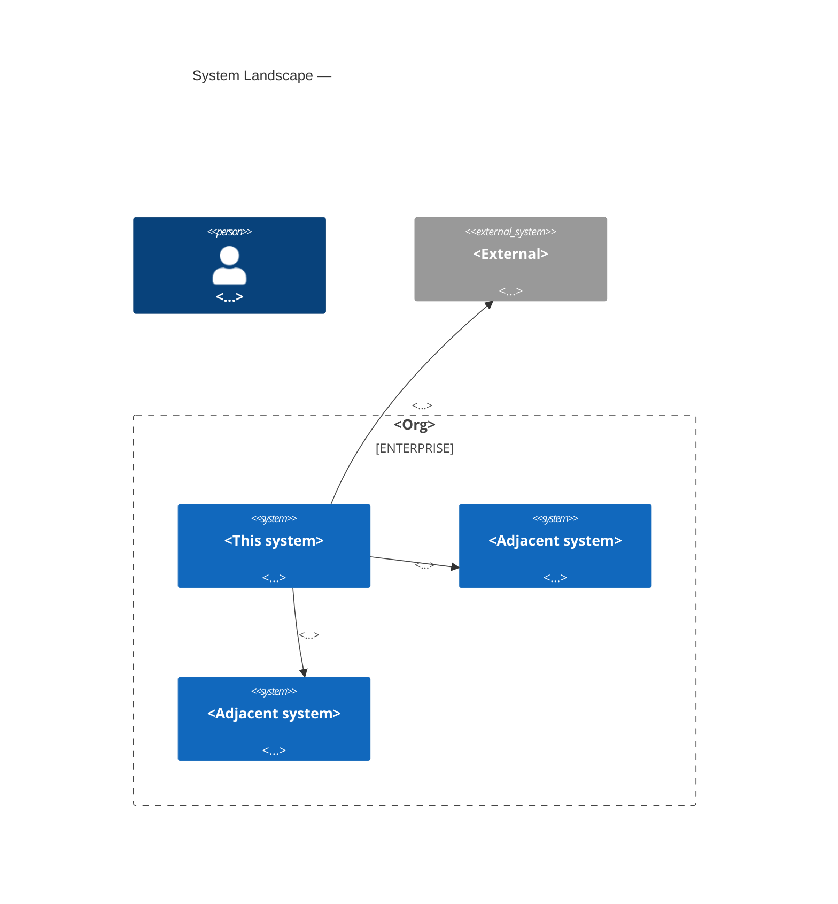
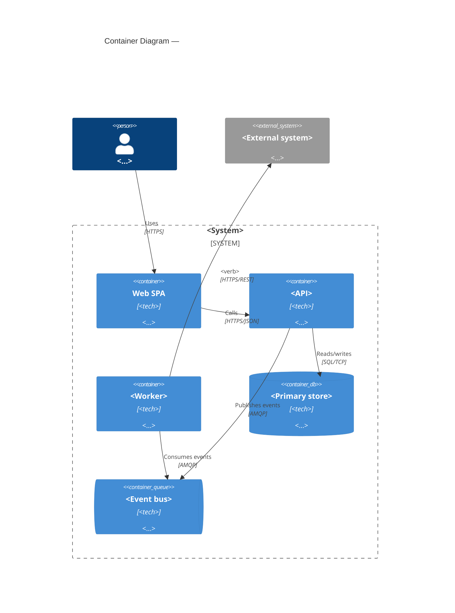
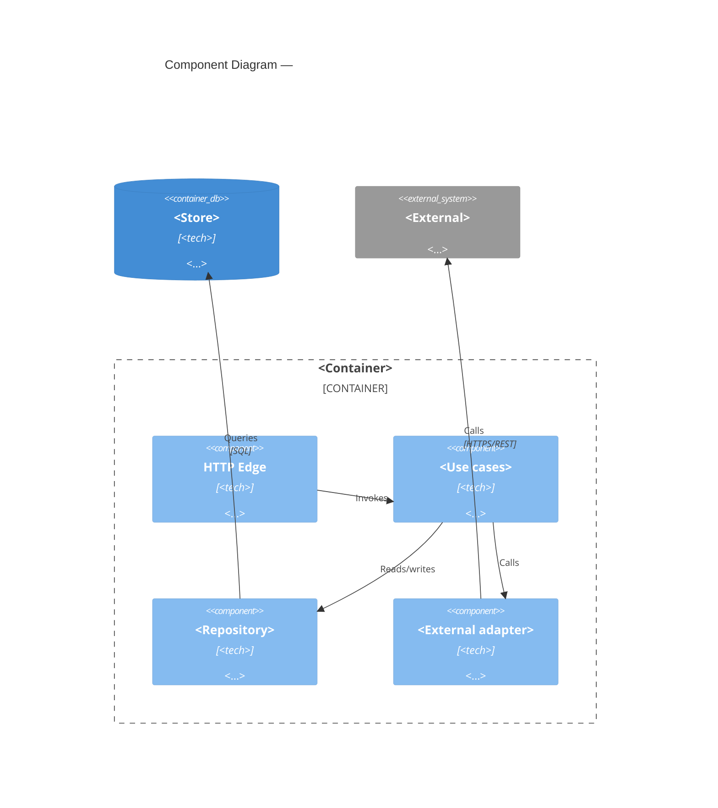
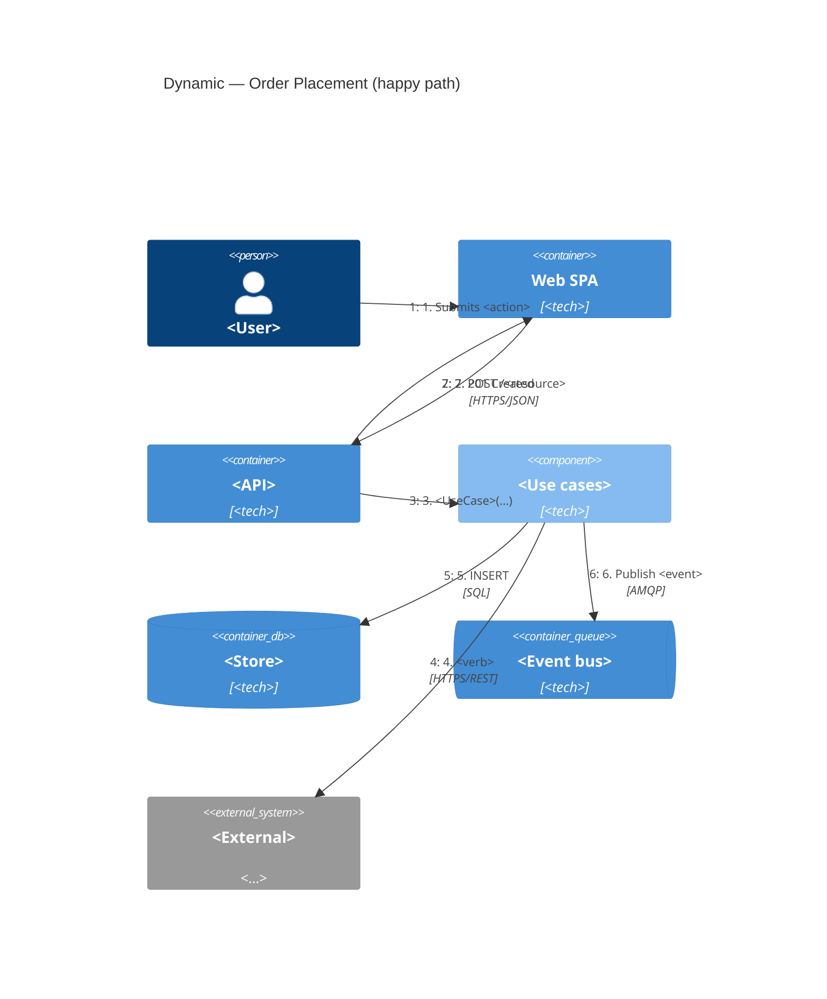

# Design Doc: <System or Capability Name>

- **Status:** Draft | In Review | Approved | Implemented | Deprecated
- **Authors:** <names>
- **Reviewers:** <names — architecture group, affected tech leads, security, SRE>
- **Last updated:** YYYY-MM-DD
- **Related ADRs:** <links to ADR-NNN documents this design is consistent with>

> **How to use this template.**
> Every section marked **(required)** has a deliverable that must be present before this doc is considered ready for review. C4 diagrams are first-class — they are not appendices, they sit inline with the prose they support. Diagrams marked **(required)** must be filled in with real mermaid; placeholder text is not enough. Sections marked **(if applicable)** can be skipped with a one-line "N/A because <reason>" — never silently omitted.

---

## 1. Context and Problem (required)

<2–4 paragraphs. What's the situation that made this design necessary? What does success look like in business terms? Who are the users / actors? What can't change (compliance, deadline, existing systems, team boundaries)?

End with the **problem statement** — a single sentence framing what this design is for.>

### 1.1 Goals (required)

- <Goal 1 — outcome, not solution>
- <Goal 2>
- <Goal 3>

### 1.2 Non-goals (required — at least three)

<Explicitly listing what is out of scope is more useful than listing what's in scope. Be specific. "Out of scope: real-time analytics dashboard" is useful. "Out of scope: nice-to-haves" is not.>

- <Non-goal 1>
- <Non-goal 2>
- <Non-goal 3>

### 1.3 Stakeholders (required)

<Who has skin in this design? Engineering teams, product owners, ops, security, finance, external partners. Each named with their interest.>

---

## 2. Quality Attribute Scenarios (required)

<The set of measurable scenarios this design must satisfy. Walk the standard categories (performance, scalability, availability, security, modifiability, deployability, cost, operability — see `quality-attributes.md`) and produce a QAS for each that is architecturally significant. If a category isn't architecturally significant, write "Not architecturally significant — handled by defaults" rather than omitting it. Use the six-part scenario template; vague NFRs are not acceptable.>

| ID | Category | Scenario (Source / Stimulus / Environment / Artifact / Response / Measure) |
|---|---|---|
| QAS-1 | Availability | A single AZ failure in the primary region occurs during business hours. The order placement and lookup APIs continue to serve traffic; RTO ≤ 60 s; RPO = 0 for confirmed orders. |
| QAS-2 | Performance — placement | <fill in> |
| QAS-3 | Performance — lookup | <fill in> |
| QAS-4 | Scalability | <fill in> |
| QAS-5 | Security | <fill in> |
| QAS-6 | Modifiability | <fill in> |
| QAS-7 | Deployability | <fill in> |
| QAS-8 | Cost | <fill in> |
| QAS-N | <as needed> | <fill in> |

---

## 3. Constraints (required)

<The forces that aren't QASes but still shape the design. These usually dominate the recommendation.>

- **Compliance:** <e.g. GDPR, PCI-DSS Level 1, SOC2, HIPAA>
- **Data residency:** <e.g. EU customer data must stay in EU regions>
- **Existing integrations:** <systems we must talk to, contracts we must honour>
- **Team capacity:** <team size, ramp-up time, key skills present or absent>
- **Budget:** <CAPEX/OPEX bounds, vendor commitments>
- **Deadline:** <hard date, with the business reason behind it>
- **Operational maturity:** <observability, on-call, deploy automation — what's there, what isn't>
- **Vendor / lock-in policy:** <e.g. "single-cloud OK", "must be portable across two clouds", "managed services preferred">

---

## 4. Considered Options (required — at least three, spanning the design space)

<Three or more candidate architectures that are *genuinely different in shape* — not three flavours of the same idea. Each option gets a one-paragraph summary and a **C4 Container diagram** so the differences are visible, not just narrated. Always include a deliberately under-engineered baseline.>

### 4.1 Option A — <name>

<One-paragraph summary. What's the shape? Where does complexity sit?>



### 4.2 Option B — <name>

<One-paragraph summary.>

```mermaid
C4Container
    title Container Diagram — Option B
    %% ... fill in
```

### 4.3 Option C — <deliberately conservative baseline or "do nothing">

<One-paragraph summary.>

```mermaid
C4Container
    title Container Diagram — Option C (baseline)
    %% ... fill in
```

---

## 5. Tradeoff Analysis (required)

<Score each option against the QASes and constraints. Cells: ✓ / ~ / ✗ or +2/+1/0/-1/-2 — consistent within the matrix. Don't hide the tradeoffs in prose.>

| | Option A | Option B | Option C |
|---|---|---|---|
| **QAS-1** Availability | | | |
| **QAS-2** Perf — placement | | | |
| **QAS-3** Perf — lookup | | | |
| **QAS-4** Scalability | | | |
| **QAS-5** Security | | | |
| **QAS-6** Modifiability | | | |
| **QAS-7** Deployability | | | |
| **QAS-8** Cost | | | |
| **Constraint: ops maturity** | | | |
| **Constraint: data residency** | | | |
| **Reversibility** | One-way / two-way | ... | ... |

### 5.1 Sensitivity and tradeoff points

<Which decisions are heavy hitters for which QAs? Where do options sacrifice one QA for another? See `tradeoff-analysis.md` for the ATAM-lite vocabulary.>

- **Sensitivity:** <e.g. "Single primary DB is sensitivity point for availability — failover is the dominant determinant of RTO.">
- **Tradeoff:** <e.g. "Synchronous cross-AZ replication improves durability and degrades write latency.">

### 5.2 Risks and Non-Risks

- **Risks** (if wrong, a QAS fails):
  - <Risk 1 — option, QAS, mitigation>
  - <Risk 2>
- **Non-risks** (worth recording so future reviews don't re-litigate):
  - <Non-risk 1>

---

## 6. Recommended Architecture (required)

**Recommendation:** Option <N> — <name>.

**Rationale:** <One paragraph tying directly to the QASes and constraints. Which drivers does this satisfy, at what cost?>

**Reversibility:** <Two-way door | One-way door>. <One sentence on what reversal would cost.>

**Decision rule:** <The specific condition under which this recommendation would flip. "Revisit if [threshold/event]." Without this, the recommendation has no shelf life.>

### 6.1 System Context — C4 Level 1 (required)



### 6.2 System Landscape — C4 Level 1 multi-system (required if this is cross-system / solution-architecture work)

<Use this when the system under design sits among other enterprise systems and the cross-system relationships matter. Otherwise mark "N/A — single-system scope."



### 6.3 Container Diagram — C4 Level 2 (required)



### 6.4 Component Diagrams — C4 Level 3 (required for each load-bearing container)

<Produce a Component diagram for every container whose internal structure is non-obvious, load-bearing for a QAS, or about to be refactored. Skip for containers whose internals are pure CRUD or whose structure is already standard.

One sub-section per container that earns its place.>

#### 6.4.1 Component Diagram — <Load-bearing container 1>



#### 6.4.2 Component Diagram — <Load-bearing container 2>

<As needed.>

### 6.5 Dynamic Diagrams — C4 Dynamic (required, one per architecturally-significant scenario)

<Produce a Dynamic diagram for each flow that the QASes are about. The flows the QASes describe. If you have eight QASes, you don't necessarily have eight Dynamic diagrams — group by flow. But there should be at least one Dynamic per major QAS-driving scenario.

One sub-section per scenario.>

#### 6.5.1 Dynamic — <Scenario name, e.g. "Order placement (happy path)"> [QAS-2]



#### 6.5.2 Dynamic — <Scenario name, e.g. "Failure recovery"> [QAS-1]

<As needed.>

### 6.6 Deployment Diagram — C4 Deployment (required)

<Show where containers physically run: regions, AZs, networks, replicas. Detail proportionate to the reliability QASes. For multi-region active-active, draw both regions and the cross-region replication.>

```mermaid
C4Deployment
    title Deployment — <System> (region/topology)
    Deployment_Node(client, "<Client device>", "<browser/mobile>") {
        Container(spa, "Web SPA / Mobile App", "<tech>")
    }
    Deployment_Node(cdn, "CDN", "<provider>") {
        Container(assets, "Static assets", "JS/CSS/images")
    }
    Deployment_Node(region, "<Cloud region>") {
        Deployment_Node(azA, "Availability Zone A") {
            Deployment_Node(computeA, "<Compute platform>", "<k8s/ECS/Cloud Run>") {
                Container(apiA, "<API> replica", "<tech>")
                Container(workerA, "<Worker> replica", "<tech>")
            }
            Deployment_Node(dbA, "<DB primary>", "<tech>") {
                ContainerDb(storeA, "<Store (rw)>", "<tech>")
            }
        }
        Deployment_Node(azB, "Availability Zone B") {
            Deployment_Node(computeB, "<Compute platform>", "<k8s/ECS/Cloud Run>") {
                Container(apiB, "<API> replica", "<tech>")
                Container(workerB, "<Worker> replica", "<tech>")
            }
            Deployment_Node(dbB, "<DB standby>", "<tech>") {
                ContainerDb(storeB, "<Store (ro)>", "<tech>")
            }
        }
    }
    Rel(spa, cdn, "Loads assets", "HTTPS")
    Rel(spa, apiA, "API calls", "HTTPS")
    Rel(spa, apiB, "API calls", "HTTPS")
    Rel(storeA, storeB, "Streaming replication", "TCP/5432")
```

### 6.7 Runner-up Option — Container Diagram (required)

<Show the runner-up architecture as a Container diagram so the tradeoff is visible at the same fidelity as the recommendation. Prose alone doesn't convey what was given up.>

```mermaid
C4Container
    title Container Diagram — Runner-up (Option <N>)
    %% ... fill in
```

---

## 7. Cross-cutting Concerns — the Six Pillars

<Walk each pillar (see `well-architected.md`). One paragraph per pillar. If a pillar is fully addressed by the design above, say "Addressed by section X". If there's an open question, raise it as an action.>

### 7.1 Operational Excellence
<Runbooks, observability, SLOs, deploy practice, on-call.>

### 7.2 Security
<Threat model, data classification, identities, secrets, encryption, validation, compliance.>

### 7.3 Reliability
<Availability target, failure domains, retries, timeouts, RPO/RTO, degradation.>

### 7.4 Performance Efficiency
<Capacity plan, scaling, caching, profiling.>

### 7.5 Cost Optimisation
<Cost per unit of business value, attribution, right-sizing, commitments.>

### 7.6 Sustainability
<Region carbon intensity, idle elimination, data lifecycle.>

---

## 8. Migration and Rollout Plan (if applicable)

<If this design replaces or evolves an existing system, the rollout plan goes here. Use the strangler fig / branch-by-abstraction / parallel run / expand-and-contract patterns from `tech-selection.md`. Big-bang rewrites are almost never the answer.

Each phase has:
- entry and exit criteria
- rollback criteria
- a fitness function (or specific check) that proves the phase succeeded
- explicit dual-running cost while the phase is live>

| Phase | Description | Entry criteria | Exit criteria | Rollback trigger | Owner |
|---|---|---|---|---|---|
| 1 | <e.g. Strangler router live, all traffic still to legacy> | <...> | <...> | <...> | <team> |
| 2 | <e.g. Migrate capability A> | <...> | <...> | <...> | <team> |
| 3 | <...> | | | | |

---

## 9. Operational Handoff (required)

<Operational maturity is the most common gap between design and production. Address it explicitly.>

- **Runbooks** — list the named failure modes that need runbooks (single-AZ failure, primary DB failover, dependency outage, deploy rollback, data corruption discovery). Each gets a runbook before go-live.
- **SLOs and error budgets** — per QAS, list the SLO that operationalises it. Define the error-budget policy (what happens when it's burned).
- **Observability** — logs, metrics, traces. Correlation IDs end-to-end. What dashboard does the on-call open first?
- **On-call** — who pages? What's the escalation path? What's the expected pager load?
- **Capacity planning** — peak we must handle; load-tested margin; autoscaling behaviour.

---

## 10. Fitness Functions (required for one-way-door decisions)

<For each irreversible decision in this design, define the automatable check that will tell you the decision is wrong once it's running. See `tradeoff-analysis.md`.>

| QAS / decision | Fitness function | Cadence | Threshold | Owner |
|---|---|---|---|---|
| QAS-2 (placement latency) | k6 load test in nightly CI, ramp to 5k RPS | Nightly | p95 > 500 ms for 3 consecutive runs | <team> |
| QAS-1 (single-AZ failure) | Chaos drill — kill primary-AZ replicas | Weekly | RTO > 60 s | <team> |
| <decision> | <check> | <cadence> | <threshold> | <owner> |

---

## 11. Open Questions

<Things this design doesn't yet answer. Naming them is better than pretending they're resolved. Each open question gets an owner and a target date.>

- <Open question 1 — owner — target>
- <Open question 2 — owner — target>

---

## 12. Related ADRs

<Each architecturally-significant decision made in this design either has its own ADR or is recorded here. Link to existing ADRs; flag those that need to be written.>

- ADR-NNN: <title> — status
- ADR-NNN: <title> — to be written
- ADR-NNN: <title> — existing, referenced here

---

## 13. References

- <Vendor docs, RFCs, prior art, benchmarks>
- <Postmortems or incident reports informing the design>
- <External standards consulted (ISO 25010, NIST, etc.)>
