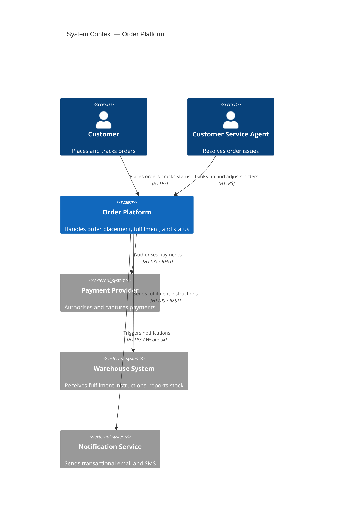
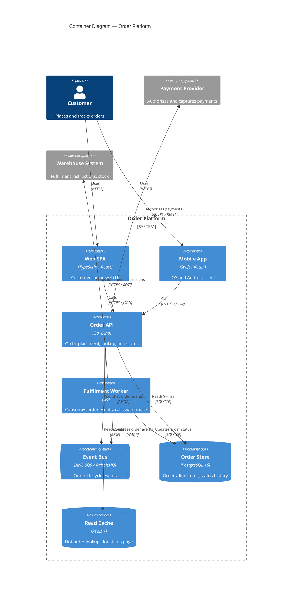
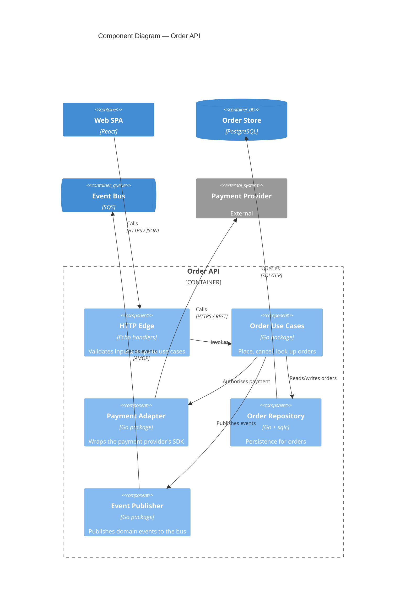
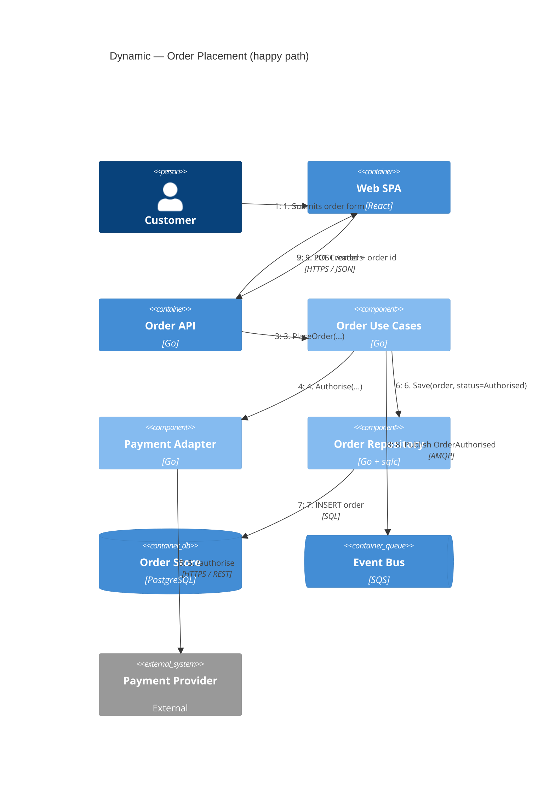
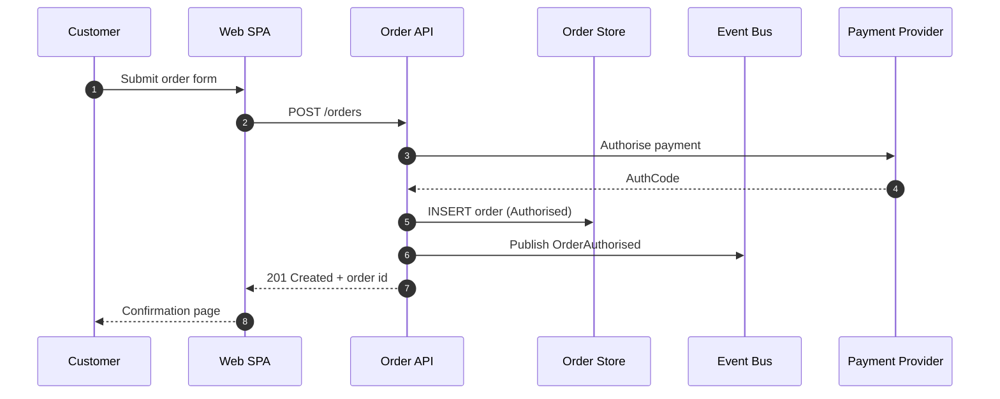
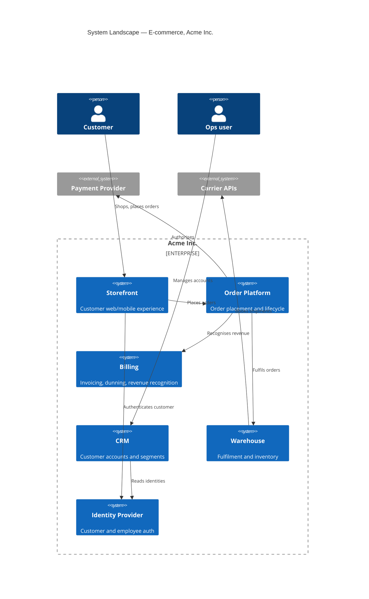
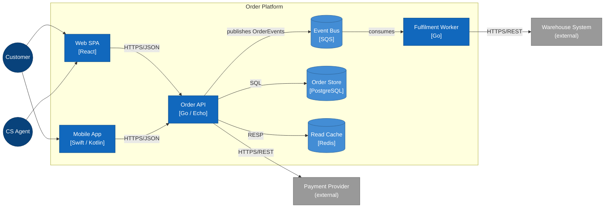

# C4 Diagrams — Reference

The C4 model (by Simon Brown) is a hierarchical way to describe software architecture at four levels of zoom, plus two supplementary views. It is the default visual language for this skill.

The core idea: **one diagram type for one audience, one question**. Every diagram has a stated scope, a primary audience, and a question it answers. Diagrams that try to do everything do nothing well — they are the architectural equivalent of writing one sentence containing every fact.

## The levels at a glance

| Level | Mermaid type | Scope | Audience | Question it answers |
|---|---|---|---|---|
| 1. System Context | `C4Context` | The system, its users, its external systems | Anyone, technical or not | "Where does this thing sit in the world?" |
| 2. Container | `C4Container` | The deployable/runnable units inside the system | Technical, internal + external | "What are the moving parts, what tech, who talks to whom?" |
| 3. Component | `C4Component` | Inside one container | Developers on that container | "How is this one container structured?" |
| 4. Code | UML class / ER | Inside one component | Developers, sometimes | "What classes / tables are involved?" — usually let tooling generate this |
| Dynamic | `C4Dynamic` | A specific runtime scenario, across containers or components | Technical | "How does flow X play out, step by step?" |
| Deployment | `C4Deployment` | Where containers physically run | Technical + ops | "Where does this live — nodes, regions, networks?" |

A **System Landscape** is a Level-1 diagram with several related systems shown together. It's the right diagram for cross-system / solution-architecture discussions.

## Mermaid status note

Mermaid's C4 diagram support is officially flagged "experimental" and has been since 2021. In practice the syntax is stable and widely rendered (GitHub, GitLab, Notion, VS Code preview, mermaid.live). But occasionally a renderer will choke on a specific element. Two coping strategies:

1. **Prefer the experimental C4 types** (`C4Context`, `C4Container`, etc.) — they produce the right semantics with the least syntax.
2. **Fall back to mermaid `flowchart`** when the C4 renderer fails (see "Fallback rendering" below). The semantics are imposed by naming and styling conventions rather than the diagram type.

Always test-render before delivering a final diagram if the environment supports it.

## Level 1 — System Context

**Purpose.** Show the system as a single box, its users, and the external systems it interacts with. Nothing else.

**Rule.** No technologies. No protocols. No internal structure. The box stays a box.

**Earn its place.** Always produce one for any new system design, any solution-architecture conversation, any architecture review where the user is not already familiar with the system's role in its environment.

### Mermaid syntax



### Element vocabulary at L1

- `Person(id, "Name", "Description")` — a human role. Not a job title; a role-from-the-system's-perspective.
- `System(id, "Name", "Description")` — the system under discussion. One per diagram, usually.
- `System_Ext(id, "Name", "Description")` — an external system (out of scope, not under your control).
- `Rel(from, to, "Label", "Optional technology")` — a relationship with a verb-phrase label and optional protocol/tech.

### Common mistakes at L1

- Showing technologies. Save that for L2.
- Showing more than one "main" system. If you have several, you want a System Landscape.
- Unlabeled relationships. Every arrow must answer "what flows in which direction?"
- Treating internal components as external systems to "simplify." That's just lying.

## Level 2 — Container

**Purpose.** Show the runnable/deployable units inside the system, the technology each uses, and how they communicate.

A "container" in C4 is not a Docker container (the name predates Docker). It is any independently runnable thing: a web app, an API, a database, a message broker, a worker, a mobile app, a single-page app, a function-as-a-service deployment. Roughly: anything you would start, stop, deploy, or scale on its own.

**Earn its place.** Always produce one for system design, architecture review, ADRs that change structure, and migration plans (both current and target).

### Mermaid syntax



### Element vocabulary at L2

- `Container(id, "Name", "Tech", "Description")` — generic application container.
- `ContainerDb(id, "Name", "Tech", "Description")` — database (cylinder shape).
- `ContainerQueue(id, "Name", "Tech", "Description")` — message broker / queue (pipe shape).
- `Container_Ext(id, "Name", "Tech", "Description")` — a container outside your boundary that still matters.
- `System_Boundary(id, "Label") { ... }` — the dashed boundary around your system. Always include.
- All Person/System/System_Ext elements from L1 still work.
- `Rel(from, to, "Label", "Tech")` — relationship with optional protocol.
- `Rel_U/Rel_D/Rel_L/Rel_R` — directional hints to influence layout (Up/Down/Left/Right).
- `BiRel(a, b, "Label")` — bidirectional.

### Common mistakes at L2

- **Missing technologies.** "API" is not a description; "Go / Echo" is. Tech labels are the point of L2.
- **Showing classes or functions.** That's L3.
- **Implicit databases.** If two containers share a DB, show it as a third container with two arrows — and then ask whether that shared DB is the right call (it usually isn't). See `anti-patterns.md`.
- **Sync arrows for async flows.** If the API publishes to a queue and a worker consumes asynchronously, draw two arrows (API→queue, queue→worker) — not one API→worker arrow.

## Level 3 — Component

**Purpose.** Zoom into a single container and show its major building blocks (modules, packages, layers, services-within-the-service).

**Earn its place.** Only for containers whose internal structure is in question — the load-bearing ones, the ones at the heart of an architectural decision, the ones you're about to refactor. Don't produce a Component diagram for every container as a matter of course; it's noise.

### Mermaid syntax



### Element vocabulary at L3

- `Component(id, "Name", "Tech", "Description")` — a module/package/internal service.
- `ComponentDb(...)`, `Component_Ext(...)`, `Container_Boundary(id, "Label") { ... }`.
- Same `Rel` family as L2.

### When to stop drilling

If a Component diagram has more than ~12 components, you are conflating the container's structure with its code. Either the container is too big (consider splitting), or you're drawing classes (let tooling do that — see L4).

## Level 4 — Code

UML class diagrams, ER diagrams, sometimes module dependency graphs. **By default, do not hand-draw L4.** The code is the diagram, and IDEs / tooling can generate L4 views on demand and keep them honest. Hand-drawn L4 rots within weeks.

Exception: a single L4 diagram explaining a non-obvious design pattern (e.g. a state machine, a visitor structure, a tricky inheritance hierarchy) can be worth it. Treat it as documentation of a *decision*, not of *the code*.

## Dynamic diagram

**Purpose.** Show a specific runtime scenario as an ordered sequence of interactions across containers or components. The architectural equivalent of a sequence diagram, but tied to the C4 element vocabulary.

**Earn its place.** Always produce one (or more) for the architecturally-significant scenarios — the flows that the QAs are about. Examples: order placement under load, login + session establishment, failure-and-retry, batch reconciliation, fan-out / fan-in. If a QA says *"p99 < 200ms for X"*, there is a Dynamic diagram for X.

### Mermaid syntax



Sequence is conveyed by the order the `Rel` statements appear and by numbered prefixes in the labels (the numbers are a convention, not enforced by mermaid). Number the steps explicitly — relying on layout alone hides the sequence under busy renders.

A more compact alternative for purely-sequential flows is a plain mermaid `sequenceDiagram` — it renders more reliably and is easier to read for many readers. Use it when none of the participants need C4 styling.



## Deployment diagram

**Purpose.** Show where containers physically run. Nodes, regions, availability zones, networks, replicas. The diagram for ops conversations.

**Earn its place.** Always produce one when topology, availability, latency-from-region, cost, or data residency is in the conversation.

### Mermaid syntax

```mermaid
C4Deployment
    title Deployment — Order Platform (eu-west-1)

    Deployment_Node(user, "Customer Device", "Browser / iOS / Android") {
        Container(client, "Web SPA / Mobile App", "TS / Swift / Kotlin")
    }

    Deployment_Node(cdn, "CDN", "CloudFront / Fastly") {
        Container(staticassets, "Static assets", "JS / CSS / images")
    }

    Deployment_Node(awsregion, "AWS eu-west-1") {
        Deployment_Node(azA, "Availability Zone A") {
            Deployment_Node(eksA, "EKS node group A", "Kubernetes") {
                Container(apiA, "Order API replica", "Go")
                Container(workerA, "Fulfilment Worker replica", "Go")
            }
            Deployment_Node(rdsA, "RDS primary", "PostgreSQL 16") {
                ContainerDb(dbA, "Order Store (rw)", "PostgreSQL")
            }
        }
        Deployment_Node(azB, "Availability Zone B") {
            Deployment_Node(eksB, "EKS node group B", "Kubernetes") {
                Container(apiB, "Order API replica", "Go")
                Container(workerB, "Fulfilment Worker replica", "Go")
            }
            Deployment_Node(rdsB, "RDS standby", "PostgreSQL 16") {
                ContainerDb(dbB, "Order Store (ro)", "PostgreSQL")
            }
        }
        Deployment_Node(sqs, "SQS", "Managed queue") {
            ContainerQueue(bus, "order-events", "SQS")
        }
    }

    Rel(client, cdn, "Loads assets", "HTTPS")
    Rel(client, apiA, "API calls", "HTTPS")
    Rel(client, apiB, "API calls", "HTTPS")
    Rel(apiA, dbA, "Reads/writes", "TCP/5432")
    Rel(apiB, dbA, "Reads/writes", "TCP/5432")
    Rel(dbA, dbB, "Streaming replication", "TCP/5432")
```

### Element vocabulary at Deployment

- `Deployment_Node(id, "Name", "Type / Tech") { ... }` — a node (region, AZ, VM, container, browser, device). Nest freely.
- `Container(...)`, `ContainerDb(...)`, `ContainerQueue(...)` — instances of containers running on a node.

### Deployment diagram discipline

- Show **redundancy explicitly.** Two API replicas means two boxes; one box with "(scaled 2x)" hides the very thing the diagram exists to show.
- Show **what crosses zones / regions** with the arrows.
- For multi-region active-active, draw both regions and the cross-region replication.
- Show **the network plane only when it matters** (e.g. private vs public subnet, VPC peering, transit gateway). Otherwise, the noise outweighs the signal.

## System Landscape diagram

**Purpose.** Multiple systems shown together, at L1 fidelity, to clarify how a system under design sits in a broader landscape. This is the standard solution-architecture diagram.

It's a C4Context diagram with several `System` boxes and the relationships between them — you may also use `Enterprise_Boundary(id, "Org") { ... }` to group systems by org/business unit.



## Notation discipline (applies to all levels)

A diagram is only as useful as it is honest. A few rules that pay back many times over.

- **Always include a title.** "System Context — Order Platform" tells the reader what they're looking at. Untitled diagrams age into mystery.
- **Always label arrows with verbs.** "Calls" is the minimum acceptable; "Authorises payment via /charge" is better. Unlabeled arrows are decoration.
- **Always state the protocol or tech on inter-system arrows** at L2 and below. "HTTPS / JSON", "AMQP", "gRPC", "SQL/TCP" — the protocol carries the failure modes.
- **One direction of meaning per arrow.** If A calls B and B also publishes events to A, draw two arrows, not a `BiRel`. The two flows have different failure modes.
- **Use boundaries (`System_Boundary`, `Container_Boundary`, `Enterprise_Boundary`)** to make scope visible. Without a boundary, the reader has to infer what's in and out.
- **Async arrows go through a queue/topic.** Drawing "A → B" when there's really "A → Q → B" hides the architectural choice. Show the queue.
- **Show shared databases as boxes between consumers, not as one DB-with-many-arrows-to-services.** If two services share a DB, that is itself a decision worth surfacing — drawing it that way makes the shared-DB anti-pattern visible (see `anti-patterns.md`).
- **Use directional rels (`Rel_U`, `Rel_D`, `Rel_L`, `Rel_R`)** sparingly, only when the default layout makes the diagram hard to read. Heavy-handed layout hints make diagrams brittle.

## Common diagram smells

- **Everything-on-one-diagram.** If a diagram has Person, System, Container, Component, and Code elements at once, it isn't a C4 diagram — it's a mural. Split it.
- **Implicit databases.** A reader cannot tell whether the database is shared, sharded, replicated, or backup-only. Always make storage explicit at L2.
- **Lossless arrows.** Every arrow says "uses", "calls", "talks to". Useless. Verbs with content.
- **No async.** A modern system without a queue or topic on its Container diagram is unusual; if you don't see one, ask whether the flows are really synchronous, or whether the diagram is hiding eventual consistency.
- **Diagrams as decoration, not analysis.** A diagram added to a doc after the prose is decoration. A diagram that drives the prose is analysis. Aim for the latter.

## Keeping diagrams alive

The hardest problem in architecture documentation is **rot**. Two practices help:

1. **Diagram-as-code, in the repo.** Mermaid files (or PlantUML / Structurizr DSL) checked into the same repo as the system. The diagram travels with the code; reviewers can require diagram updates on structural changes.
2. **Generate L1 / L2 / Deployment from a single source of truth where possible.** Tools like Structurizr DSL let you write the model once and emit Context, Container, and Component views from it. Mermaid doesn't (yet) have a model-and-view split, so for mermaid users the discipline is: keep L1 and L2 in one file with shared element ids, and update them together.

L4 (code-level) and Component (L3) diagrams for stable code are best generated by tooling on demand rather than maintained by hand. Hand-drawing L4 always rots; generated L4 is current by construction.

## Fallback rendering — mermaid `flowchart` with C4 conventions

When a renderer fails on the C4 types, the fastest workaround is to express the same diagram as a mermaid `flowchart`, imposing the C4 semantics through naming and styling. The semantics are weaker (no built-in element types), but the renderers are stable everywhere.

A flowchart-style Container diagram of the order platform:



Conventions used in the fallback:

- People as `((round nodes))`.
- Containers as `["rectangles with <br/>[technology] on a second line"]`.
- Datastores/queues as `[("cylinders")]`.
- External systems styled distinctly via a `classDef`.
- Boundary as a `subgraph` with the system name as title.
- Arrows labeled with a protocol/verb.

The same pattern works for L1 (drop the internal containers, show only the system box), L3 (subgraph one container, show internal components), and Deployment (nested subgraphs for region → AZ → node → container).

## What earns its place in a given response

This is the practical question: **how many diagrams should a given answer include?** Some defaults:

- A pure advisory question that doesn't change structure: zero or one (a small fragment if it clarifies).
- An ADR that changes structure: a before/after Container-level fragment.
- A tech-selection answer: one Container fragment showing where the chosen tech sits, plus a Dynamic for the load-bearing access pattern.
- A new-system design: Context + Container, Component for each load-bearing container, Dynamic for each QA-driving scenario, Deployment.
- An architecture review: current-state Container + Deployment, target-state Container + Deployment, plus L3 Component diagrams only where a finding requires drilling in.
- A migration plan: current-state Container + Deployment, target-state Container + Deployment.

The principle is consistent across all of these: **one diagram, one audience, one question — and produce as many as the audiences and questions warrant, no more.**
