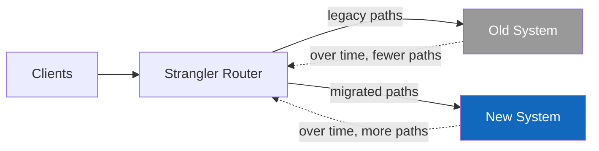

# Tech Selection — Reference

The most common architecture question is "X or Y?" — and the most common architecture mistake is to answer it. The right question is almost always not "X or Y?" but **"X or Y for *this* workload, *this* team, *this* operational context?"** This reference contains short playbooks for the dilemmas that come up most often, plus the migration patterns that move you from one to the other when the answer changes.

Each playbook has the same shape:

- **The wrong question** — the form the user usually asks it in.
- **The right question** — the reframe.
- **The decision factors** — what actually drives the choice.
- **A default and its threshold** — what to do absent strong signals, and the threshold at which to switch.

## Monolith / modular monolith / microservices

**Wrong question:** "Should we use microservices?"

**Right question:** "What is the smallest deployable unit that gives us the modifiability, scalability, and operability we need — and that our team can run?"

### Decision factors

- **Team count and shape.** One team → modular monolith almost always wins. 3–10 teams → modular monolith or carefully-bounded services. 10+ teams → services are likely worth the cost. Number of teams matters far more than codebase size.
- **Deploy independence requirement.** Do teams genuinely need to deploy without coordinating? If "deploy after lunch on Friday" is a yes, a monolith hurts; if it's a no, microservices buy nothing and cost a lot.
- **Scale heterogeneity.** Does one component need 100× the resources of another? Independent scaling is a real benefit of services. If everything scales together, services give you nothing here.
- **Failure isolation requirement.** Must one feature's failure not impact others? Services help; in a monolith you can approximate this with circuit breakers and resource isolation but never fully achieve it.
- **Operational maturity.** Distributed systems require: distributed tracing, log aggregation, service discovery, deploy automation, SLOs, on-call rotations per service, runbooks. If those aren't in place, services will hurt more than they help.
- **Domain boundary clarity.** Microservices require bounded contexts that are actually stable. If your domain boundaries are still being learned, services lock in the wrong lines.

### Defaults and thresholds

- **Default: modular monolith.** One deployable, internally split by bounded context with strict module boundaries and no cross-module data access. Most systems should be this. Most systems that left it did so for the wrong reasons.
- **Switch to services when:** ≥3 teams need deploy independence, *and* you have or will pay for the operational maturity, *and* the bounded contexts have stabilised, *and* there is at least one team-shaped or scale-shaped problem the monolith cannot solve.
- **If splitting, extract one service first** — the highest-friction one — using the strangler-fig pattern (below). Run for two quarters before extracting a second.

### Red flags

- "We need microservices to scale." Usually false. A modular monolith scales horizontally fine for most workloads.
- "Microservices because each team can use its own language." This is rarely a benefit; it is almost always a tax. Standardise on a small language set.
- "Microservices with a shared database." This is a distributed monolith. Worst of both worlds. See `anti-patterns.md`.

## SQL vs NoSQL (and which kind of which)

**Wrong question:** "Postgres or DynamoDB?" / "SQL or NoSQL?"

**Right question:** "What is the shape of our data, the access pattern, the consistency requirement, and the operational profile we can sustain?"

### Decision factors

- **Access pattern.** Are queries known in advance (key lookups, defined indexes) or ad-hoc (analyst joins, evolving reports)? Known patterns favour key-value / document; ad-hoc favours relational.
- **Schema variability.** Is the data well-structured and stable, or genuinely heterogeneous? Relational + JSONB handles most "semi-structured" cases without dropping the relational benefits.
- **Consistency requirement.** Strong consistency by default → relational (Postgres, MySQL). Eventual consistency acceptable for most reads → distributed KV (DynamoDB, Cassandra, Scylla).
- **Data volume and growth.** Sub-terabyte and growing linearly → relational comfortably. Tens of TB and growing fast → distributed store, or relational with a clear sharding/partitioning plan.
- **Query joins.** Heavy multi-entity joins → relational. Single-aggregate access → document/KV.
- **Team familiarity and operational tooling.** Postgres has the deepest tooling and operational know-how. Newer stores have specific strengths but a steeper operational curve.
- **Transactionality.** Multi-row, multi-table transactions → relational. Single-row updates → either.

### Defaults and thresholds

- **Default for transactional workloads: PostgreSQL.** It is the most boring, most flexible, most operationally mature default. JSONB handles the document-style cases; partitioning handles moderate scale; logical replication handles read replicas and migration.
- **Default for high-write-rate logs / events: append-only relational table or a dedicated log store (Kafka, Kinesis).** Not a generic NoSQL store.
- **Default for very high-fanout key lookups (caches): Redis.** Not the primary store.
- **Switch to a distributed KV (DynamoDB / Cassandra / Scylla)** when: volume and write rate exceed what a sharded relational store can sustain economically, *and* the access pattern is genuinely key/aggregate-based, *and* the operational team can handle the eventual-consistency semantics.
- **Switch to a document store (MongoDB) when:** the data is genuinely document-shaped (rich nested aggregates accessed as a unit), and the relational + JSONB combination has been tried and found wanting. This is rarer than vendor materials suggest.
- **Switch to a graph store (Neo4j) when:** the queries are genuinely graph-shaped (variable-depth traversals, shortest paths, community detection), and the workload is not a fit for relational recursive CTEs. Also rarer than it appears.
- **Switch to a time-series store (TimescaleDB, InfluxDB, ClickHouse)** when: the workload is dominated by time-ordered writes and time-range aggregations, and a relational store with a partitioned hot/cold split has been tried first.

### Red flags

- "MongoDB because the schema will evolve." Postgres with JSONB does this better.
- "DynamoDB for everything." DynamoDB is excellent for known-access-pattern, high-fanout key lookups; it is poor for ad-hoc queries and complex relational data. Use it for what it's good at.
- "We need NoSQL because we need to scale." Relational stores scale further than most teams realise. Exhaust the relational option before adopting a distributed-only data model.

## Synchronous vs asynchronous communication

**Wrong question:** "Should we use a message broker?"

**Right question:** "Which calls genuinely need to happen on the critical path, and which exist only because the system wasn't designed to decouple them?"

### Decision factors

- **Latency tolerance of the caller.** Synchronous calls are simple and add latency in series. If the caller's QAS doesn't allow that latency, async.
- **Availability coupling.** Synchronous calls couple availability: A's uptime is bounded by B's. If you need A to be available when B is down, async.
- **Fan-out.** One event consumed by multiple subscribers strongly favours async (publish/subscribe). Synchronous fan-out is a fragility multiplier.
- **Ordering and exactly-once.** Async with at-least-once delivery is the common case; effectively-once requires idempotent consumers. If exact ordering matters across an entire system, look at a log (Kafka) rather than a queue.
- **Workflow / orchestration.** Long-running workflows want async by nature (the workflow engine is itself an async tool — Temporal, Cadence, Airflow, Step Functions).
- **Operability and observability.** Async is harder to debug. You need correlation IDs, traces, queue depth metrics, DLQ monitoring. If you don't have these, sync is safer until you do.

### Defaults and thresholds

- **Default for internal API calls: synchronous HTTP/gRPC.** Simple, well-understood, easy to debug.
- **Switch to async (queue or topic) when:** the call is on the critical path *and* the dependency's availability is materially lower than yours, *or* you need fan-out, *or* the work is genuinely fire-and-forget (notifications, derived-data updates, analytics).
- **Choose a queue (SQS, RabbitMQ) when:** point-to-point, no replay, modest throughput, simple semantics.
- **Choose a log (Kafka, Kinesis, Redpanda) when:** multi-consumer with independent offsets, replay required, very high throughput, event-sourcing or stream-processing pattern.
- **Choose a workflow engine (Temporal, Step Functions, Camunda) when:** the flow is multi-step with retries, compensation, and long durations — and the orchestration logic is itself the architecture.

### Red flags

- Async everywhere by default. Async has real costs (debugging, idempotency, eventual consistency, observability burden); don't pay them where sync would work.
- A queue between two services that always call each other in lockstep. That's sync with extra steps; remove the queue.
- A workflow engine for what is really a chain of three synchronous calls. Overkill.

## REST vs gRPC vs GraphQL

**Wrong question:** "REST or GraphQL?"

**Right question:** "Who calls this API, how diverse are their needs, and how strong is the type contract?"

### Decision factors

- **Caller diversity.** Public API consumed by many unknown clients → REST (broad tooling, cacheable, well-understood). Internal, controlled clients → gRPC is fine. A varied set of internal UIs that each fetch slightly different shapes → GraphQL pays off.
- **Type safety.** Strong typed contracts → gRPC (protobuf) or GraphQL (schema). Loose → REST + OpenAPI.
- **Latency and throughput.** gRPC over HTTP/2 is faster on the wire and amortises connection costs well; matters for high-RPS internal service-to-service traffic.
- **Tooling and team familiarity.** REST is the most familiar by far. gRPC requires codegen pipelines. GraphQL requires careful query-cost analysis to avoid N+1 problems in resolvers.
- **Streaming.** Bidirectional streaming → gRPC or WebSockets. Server-push → SSE or WebSockets. REST is request/response only.
- **Caching.** HTTP-cacheable resources are a huge benefit for read-heavy public APIs — REST wins. gRPC and GraphQL responses are harder to cache at the edge.

### Defaults

- **Public-facing API: REST + OpenAPI.** Boring, cacheable, every client supports it.
- **Internal service-to-service: REST is fine.** gRPC for the high-volume hot paths where the codegen ergonomics earn their place.
- **Multi-UI BFF (mobile + web + smart TV, each needing different shapes): GraphQL** at the gateway, REST or gRPC underneath.

### Red flags

- GraphQL as the default for everything. The cost (N+1, complex caching, query cost) is real and most APIs don't need its flexibility.
- gRPC for browser clients. Browser support is partial and the operational overhead is large.
- REST with action endpoints (`/users/createUser`, `/orders/markAsPaid`). That's RPC-with-REST-clothes; use REST resources properly or use RPC honestly.

## Server vs serverless (FaaS)

**Wrong question:** "Should we go serverless?"

**Right question:** "What is the workload shape (steady or spiky), the latency tolerance (cold starts), and the cost-vs-control balance we want?"

### Decision factors

- **Workload shape.** Spiky / unpredictable / low average → FaaS wins on cost. Steady / high average → containers win on cost by a wide margin.
- **Cold-start tolerance.** If the QAS allows 200–500 ms cold-start variability, FaaS is fine. If it doesn't, provisioned concurrency closes most of the gap but raises cost; long-running containers don't have the problem.
- **Per-invocation cost vs steady-state cost.** FaaS economics break down above a certain steady utilisation (typically ~20–40% of an always-on container's load); past that, containers are cheaper.
- **Local-stateful work.** FaaS is poor at anything with significant warm state (caches, connection pools, in-memory indexes). Containers handle this naturally.
- **Operational maturity.** FaaS reduces ops surface but introduces new failure modes (provider limits, concurrency, async-invocation semantics). Both require maturity; they're different maturities.

### Defaults

- **Spiky, event-driven, low average (under ~20% of a container's load): FaaS.** Examples: webhook handlers, image-resize-on-upload, scheduled jobs that run once an hour.
- **Steady customer-facing workloads: containers (managed K8s or container service).** Predictable cost, no cold starts, straightforward observability.

### Red flags

- "Microservices on Lambda for everything." Lambda pinball — many small functions chained synchronously — is the worst of both worlds. See `anti-patterns.md`.
- "Serverless to save money" without doing the cost-curve math. Frequently false.

## Build vs buy

**Wrong question:** "Should we build this ourselves?"

**Right question:** "Is this capability a source of differentiation, and what is the total cost of owning it (build + maintain + operate + replace) vs the total cost of buying it (licence + integration + lock-in)?"

### Decision factors

- **Differentiation.** If the capability is the product (or a competitive advantage of the product), lean to build. If it's table stakes (auth, payments, billing, search index, observability), lean to buy.
- **TCO over 5 years, not 1.** Build looks cheap in year 1 and expensive forever after. Buy looks expensive in year 1 and predictable after. Both have hidden costs (integration for buy; maintenance, on-call, and ongoing development for build).
- **Lock-in cost.** Buying ties you to the vendor's roadmap, pricing, and survival. Estimate the cost to switch vendors before signing.
- **Speed-to-market.** Buying is faster to first value; building is faster to specific-fit.
- **Compliance and data residency.** Some markets and regulations make buying impossible or risky. Some make building impossible.
- **Team capacity.** Building takes a team that won't be available for other work. Be honest about opportunity cost.

### Defaults

- **Default: buy commodities, build differentiators.** Auth — buy (Auth0, Okta, Clerk). Payments — buy (Stripe). Email — buy (SendGrid, Postmark). Observability — buy (Datadog, Honeycomb, Grafana Cloud) unless you have a very high-volume, very specific need. CMS — buy. Search relevance for *your specific corpus and ranking model* — probably build.
- **Buy with an exit plan.** Wrap the vendor behind your own abstraction (adapter pattern) so swapping vendors later is a few weeks, not a quarter.

### Red flags

- "We can build this in two weeks." Almost always wrong. The build is two weeks; the long tail is years.
- "It's strategic, so we have to build." Sometimes true; often a justification for not having compared TCO.
- "We bought it, we'll never have to think about it." Vendor outages, deprecations, and pricing changes are recurring events.

## Migration patterns

When the answer changes — when you've decided to move from A to B — these are the patterns that move you there without breaking things. **Big-bang rewrites are almost never the answer.** Their empirical record is brutal: long delays, parallel-running cost, feature freeze on the old system, lost institutional knowledge. Plan to avoid them.

### Strangler Fig

Named after the strangler fig tree (which grows around an existing tree and replaces it over time, with no chainsaw involved).

**How:** Put a router/proxy/facade in front of the old system. Migrate one capability at a time to the new system, routing calls for that capability to the new path. Keep going until the old system has no traffic and can be turned off.

**When:** Any system migration where you can identify capability seams and route calls based on them.

**Why it works:** Risk is bounded per capability; rollback is a routing change; the old system stays live until each piece is proven; users see continuous behaviour.

### Branch by Abstraction

**How:** Introduce an abstraction in the codebase that hides the difference between old and new implementations. Migrate callers to the abstraction. Implement the new behaviour behind the abstraction. Toggle. Remove the old implementation.

**When:** Replacing a library, a data access layer, or an internal subsystem within a single deployable.

**Why it works:** No long-lived feature branches; the codebase stays continuously deployable; the toggle is a small, reversible change.

### Parallel Run / Shadow Mode

**How:** Run the new system alongside the old, with the same inputs. Compare outputs. Initially the old system is authoritative; over time, switch authority to the new system.

**When:** Replacing pricing engines, risk scoring, search rankers, fraud detection — anywhere the correctness of the new system is the core risk and you need real production data to validate.

**Why it works:** Discrepancies are visible before any user impact; rollback is "switch authority back".

### Expand and Contract (also: Parallel Change)

**How:** When changing a schema or interface, expand the contract to support both old and new shapes. Migrate writers to write both. Migrate readers to read the new. Migrate writers to write only the new. Contract by removing the old shape.

**When:** Schema migrations on a live database, API version changes, message format changes.

**Why it works:** No moment requires coordinated change across all writers and readers; each step is small and reversible.

### Database Migration: Dual Writes + Backfill

**How:** Add writes to the new store alongside the old. Backfill historical data. Run consistency checks. Switch reads from old to new. Stop writing to old. Decommission.

**When:** Replacing a primary database, switching from one cloud's managed DB to another, moving from a shared DB to per-service stores.

**Caveats:** Dual writes raise hard consistency questions (what if one write succeeds and the other fails?). Use an outbox pattern or change-data-capture to make the propagation reliable; do not rely on application code doing both writes correctly under load.

## What to record about a tech selection

Whatever the dilemma, the output of the analysis should be:

1. **The reframed question** — the wrong question made right.
2. **The workload/team/ops profile** that drove the decision — the data, not the gut.
3. **The recommendation** — single, clear, with the decision rule.
4. **The reversibility classification** — one-way or two-way door.
5. **At least one C4 fragment** showing the chosen tech in context.
6. **A fitness function** for the irreversible-or-significant case.

If those six pieces aren't in the response, the analysis isn't done yet.
